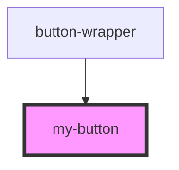

# my-button

<!-- Auto Generated Below -->

## Properties

| Property      | Attribute | Description | Type         | Default     |
| ------------- | --------- | ----------- | ------------ | ----------- |
| `passedClick` | --        |             | `() => void` | `undefined` |
| `type`        | `type`    |             | `string`     | `undefined` |

## Dependencies

### Used by

 - [button-wrapper](../button-wrapper)

### Graph

----------------------------------------------

*Built with [StencilJS](https://stenciljs.com/)*
